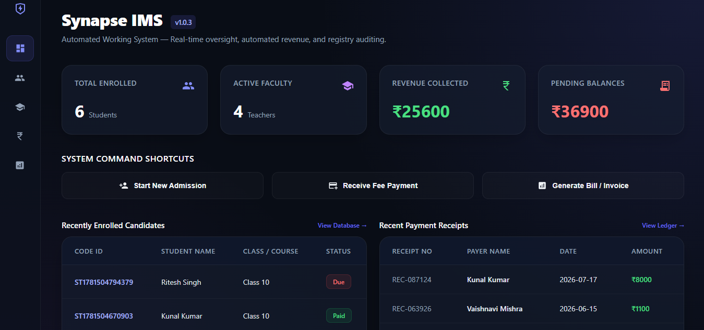

# Synapse IMS — Institute Management System

Synapse IMS is a full-stack web application built to simplify student administration, fee management, and institutional record keeping for coaching centers and educational institutes.

## Features

### Student Management

* Student admission and profile management
* Student directory with search and filtering
* Academic and personal information tracking

### Fee Management

* Course fee tracking
* Additional charges and discounts management
* Remaining balance calculation
* Payment history records

### Receipt & Reporting

* Printable fee receipts as pdf
* Mobile-friendly invoice generation
* Student payment reports

### Teacher Management

* Teacher directory
* Salary record management
* Teacher information tracking

### Dashboard

* Student statistics
* Revenue overview
* Pending fee tracking
* Quick-access tools

## Technology Stack

**Frontend**

* React.js
* CSS

**Backend**

* Supabase
* PostgreSQL

**Other Tools**
* Node.js
* Git & GitHub

## Future Improvements

* Authentication and role-based access
* Advanced analytics dashboard
* Attendance management
* Mobile app support
